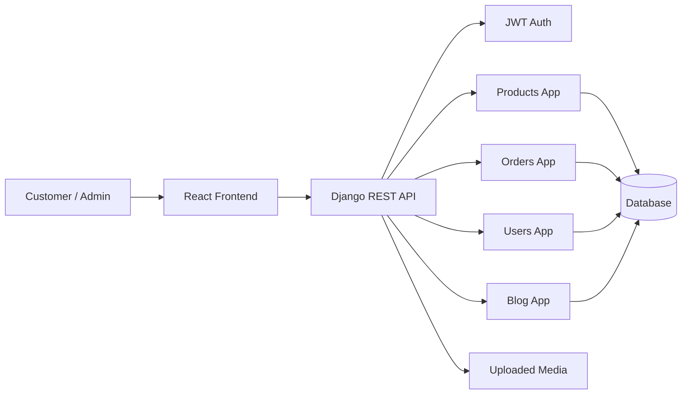
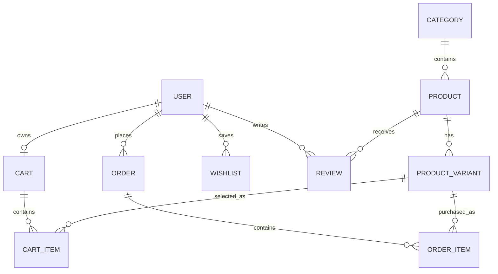

# TempoTempo

TempoTempo is a full-stack ecommerce platform for digital gaming products such as gift cards, game time, and activation codes. It is built as a Software Engineering bachelor degree project with a Django REST API, JWT authentication, and a React/Vite frontend.

## Project Goals

- Provide a complete customer shopping flow from product discovery to checkout.
- Support digital product catalog management through Django Admin.
- Include user accounts, profile management, cart, wishlist, orders, coupons, reviews, and blog content.
- Demonstrate software engineering practices: layered architecture, validation, authentication, automated tests, environment-based configuration, and documentation.

## Main Features

- Customer registration and JWT login
- Product categories, products, variants, stock, featured products, and search
- Cart management with quantity validation and stock limits
- Transaction-safe checkout with coupon support and stock reduction
- Order history for customers
- Wishlist and verified-buyer product reviews
- Admin dashboard with revenue, order, user, and product statistics
- Blog system for published articles
- Responsive Persian/RTL frontend
- Backend tests for key business flows

## Technology Stack

| Layer | Technology |
| --- | --- |
| Backend | Django, Django REST Framework |
| Authentication | Simple JWT |
| Database | PostgreSQL for production-like use, SQLite fallback for local tests |
| Frontend | React, Vite, React Router |
| State Management | Zustand |
| HTTP Client | Axios |
| Styling | CSS Modules and global CSS |

## Architecture



## Data Model Overview



## Local Setup

### Backend

1. Create and activate a virtual environment.
2. Install dependencies:

```bash
pip install -r requirements.txt
```

3. Copy `.env.example` to `.env` and adjust values if needed.
4. Run migrations:

```bash
python manage.py migrate
```

5. Create an admin user:

```bash
python manage.py createsuperuser
```

6. Start the backend:

```bash
python manage.py runserver
```

Optional demo data for presentations:

```bash
python manage.py seed_demo
```

This creates sample products, variants, a coupon code `DEMO10`, one blog post, and an admin user
with the email `admin@tempotempo.test`.

The admin password is read from the `DEMO_ADMIN_PASSWORD` environment variable and is intentionally
not published in this repository. Set it before seeding — always for a public deployment:

```bash
DEMO_ADMIN_PASSWORD='<choose-a-strong-password>' python manage.py seed_demo
```

If the variable is unset, a weak development-only default is used. Never rely on that default for a
deployment that is reachable from the internet.

### Frontend

1. Open the frontend folder:

```bash
cd frontend
```

2. Install dependencies:

```bash
npm install
```

3. Copy `frontend/.env.example` to `frontend/.env` if the API URL changes.
4. Start the frontend:

```bash
npm run dev
```

## Useful Commands

Run backend checks:

```bash
python manage.py check
```

Run backend tests with SQLite:

```bash
USE_SQLITE=True python manage.py test
```

Build the frontend:

```bash
cd frontend
npm run build
```

Lint the frontend:

```bash
cd frontend
npm run lint
```

On Windows PowerShell, use `$env:USE_SQLITE='True'; python manage.py test`.

## Online Presentation Deploy

The project is prepared for a low-cost hosted demo with:

- Django API and PostgreSQL on Render using `render.yaml`
- React/Vite frontend on Vercel from the repo root or the `frontend` directory

Render creates the free PostgreSQL database, installs Python dependencies, collects static files, runs migrations, and seeds the demo catalog through `build.sh`. The default API URL expected by the production frontend is:

```text
https://tempotempo-api.onrender.com/api
```

For Vercel, `vercel.json` builds the `frontend` app and sets `VITE_API_BASE_URL` for the presentation API. The frontend also includes `frontend/vercel.json` for setups where the Vercel project root is configured as `frontend`.

## API Overview

| Method | Endpoint | Purpose |
| --- | --- | --- |
| POST | `/api/auth/register/` | Create customer account |
| POST | `/api/auth/login/` | Get JWT access and refresh tokens |
| GET/PATCH | `/api/auth/me/` | Read or update profile |
| POST | `/api/auth/change-password/` | Change password |
| GET | `/api/products/` | List products with pagination, category filter, and search |
| GET | `/api/products/categories/` | List categories |
| GET | `/api/products/<slug>/` | Product detail |
| GET/POST | `/api/cart/` | Read cart or add item |
| PATCH/DELETE | `/api/cart/<item_id>/` | Update or remove cart item |
| POST | `/api/coupon/validate/` | Validate discount code |
| POST | `/api/checkout/` | Create order and reduce stock |
| GET | `/api/orders/` | Customer order history |
| GET/POST/DELETE | `/api/wishlist/` | Manage wishlist |
| GET/POST | `/api/reviews/<product_id>/` | Read or write reviews |
| GET | `/api/admin/stats/` | Admin statistics |
| GET/PATCH | `/api/admin/orders/` | Admin order management |
| GET | `/api/blog/` | Published blog posts |
| GET | `/api/blog/<slug>/` | Blog post detail |

## Quality Improvements Included

- Checkout now runs inside a database transaction.
- Product stock is checked before checkout and reduced after order creation.
- Coupon usage is validated and incremented safely.
- Cart quantities are validated and cannot exceed stock.
- Product list queries use `select_related`, `prefetch_related`, and annotated starting prices.
- Duplicate serializer and URL definitions were removed.
- Settings are environment-driven and support local SQLite testing.
- CKEditor 4 dependency was removed to avoid the unsupported package warning.
- Tests cover authentication, products, checkout, coupons, stock handling, reviews, and blog visibility.
- A demo seed command creates realistic data for live presentations.

## Suggested Future Work

- Add payment gateway integration.
- Add order detail pages and downloadable digital code delivery.
- Add admin product creation/editing inside the React dashboard.
- Add frontend component tests and end-to-end tests.
- Add Docker Compose for backend, frontend, and PostgreSQL.
- Add email notifications for order status changes.
