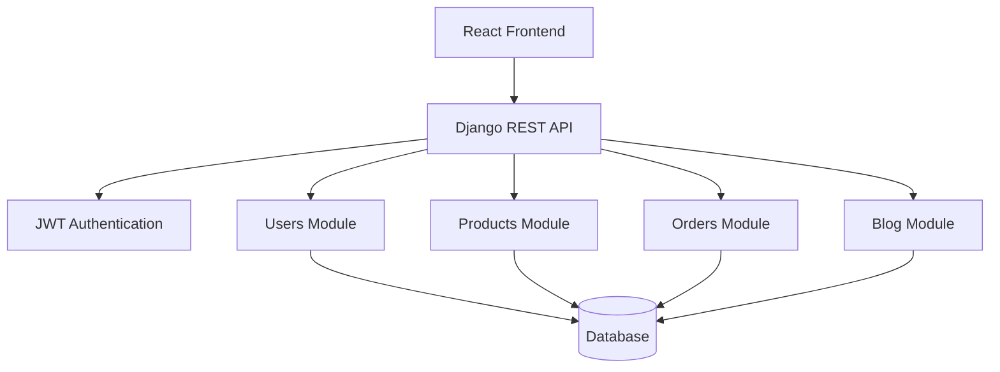

# Bachelor Project Report Outline

## 1. Title

TempoTempo: A Full-Stack Ecommerce Platform for Digital Gaming Products

## 2. Abstract

This project presents the design and implementation of a full-stack ecommerce system for digital gaming products. The system supports customer registration, authentication, product browsing, cart management, coupon validation, order creation, wishlist management, verified-buyer reviews, blog content, and administrative analytics. The backend is implemented with Django REST Framework and JWT authentication, while the frontend is implemented with React and Vite.

## 3. Problem Statement

Digital gaming products such as gift cards and game activation codes require fast discovery, secure account access, reliable stock management, and clear order tracking. A manual or poorly structured sales process can create overselling, weak reporting, poor user experience, and limited administrative control.

## 4. Objectives

- Build a complete ecommerce workflow for digital products.
- Separate backend business logic from frontend presentation.
- Implement authentication and role-based admin behavior.
- Validate cart, stock, coupon, and review rules.
- Provide a maintainable codebase with tests and documentation.
- Demonstrate software engineering principles through architecture, modularity, and verification.

## 5. Users and Roles

| Role | Capabilities |
| --- | --- |
| Guest | Browse products and blog posts |
| Customer | Register, login, manage profile, use cart, checkout, wishlist, review purchased products |
| Admin | Manage catalog data through Django Admin, view dashboard stats, update order statuses |

## 6. Functional Requirements

- The system shall allow users to register and login by email.
- The system shall display active products and categories.
- The system shall support product search and category filtering.
- The system shall allow authenticated users to add product variants to the cart.
- The system shall prevent checkout when requested quantity exceeds stock.
- The system shall calculate order totals and apply valid coupons.
- The system shall reduce stock after successful checkout.
- The system shall allow customers to view their order history.
- The system shall allow reviews only from users with completed orders.
- The system shall expose admin statistics for revenue, orders, users, and products.

## 7. Non-Functional Requirements

- Maintainability: separate Django apps for users, products, orders, and blog.
- Security: JWT authentication, environment-based secrets, admin-only endpoints.
- Reliability: transaction-safe checkout and automated tests.
- Usability: responsive RTL frontend with loading and empty states.
- Portability: SQLite fallback for local testing and PostgreSQL configuration for production-like use.

## 8. System Architecture

## 9. Database Design

Core entities:

- User
- Category
- Product
- ProductVariant
- Cart
- CartItem
- Order
- OrderItem
- Wishlist
- Review
- Coupon
- BlogPost

Important relationships:

- One user has one cart.
- One cart has many cart items.
- One product has many variants.
- One order has many order items.
- One user can review a product once.
- One user can wishlist a product once.

## 10. Key Algorithms and Business Rules

### Checkout

1. Load the authenticated user's cart.
2. Lock cart items and product variants in a database transaction.
3. Reject checkout if the cart is empty.
4. Reject checkout if any item quantity exceeds stock.
5. Validate coupon code if provided.
6. Create order and order items.
7. Reduce stock for each purchased variant.
8. Increment coupon usage when a coupon was applied.
9. Clear the cart.

### Reviews

1. User must be authenticated.
2. Product must exist.
3. User must have a completed order containing that product.
4. Rating must be between 1 and 5.
5. User can create or update only one review per product.

## 11. Testing Strategy

Backend API tests cover:

- Registration and login
- Profile access
- Product listing, filtering, and starting price
- Invalid cart quantities
- Checkout with coupon
- Stock reduction after checkout
- Checkout rejection when stock changes
- Verified-buyer review rule
- Published-only blog listing

## 12. Limitations

- Payment gateway integration is not included.
- Digital code delivery is represented by order creation, not automated code assignment.
- Frontend automated tests are not included yet.
- Deployment scripts and Docker Compose can be added as future work.

## 13. Future Work

- Add payment provider integration.
- Add digital code inventory and delivery after payment.
- Add email/SMS notifications.
- Add frontend end-to-end tests.
- Add Docker Compose deployment.
- Add audit logs for admin status changes.

## 14. Conclusion

TempoTempo demonstrates a complete and maintainable full-stack ecommerce system. The project includes core software engineering concerns such as modular architecture, authentication, transaction-safe business logic, validation, automated tests, documentation, and a user-facing interface. These qualities make it suitable as a bachelor degree project in Software Engineering.
